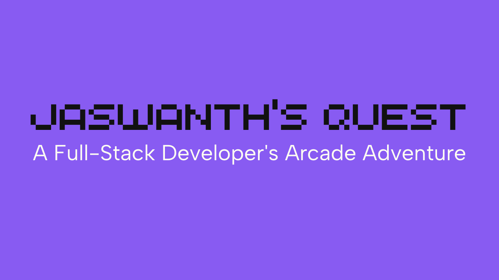

# 🎮 Jaswanth's Quest - Interactive Portfolio

An arcade-style interactive portfolio website showcasing my skills, projects, and contact information in a unique and engaging way.



## 🚀 Live Demo

Visit the live portfolio: [https://retro-quest-portfolio.lovable.app/](https://retro-quest-portfolio.lovable.app/)

## ✨ Features

- **Interactive Snake Game**: Collect skill tokens while playing
- **Arcade-Style UI**: Retro gaming aesthetics with modern web capabilities
- **Responsive Design**: Works on both desktop and mobile devices
- **Sound Effects**: Interactive audio feedback
- **Interactive Components**: Engaging user interface elements

## 🛠️ Technologies Used

The portfolio is built with modern web technologies:

### Frontend Framework
- **React**: Component-based UI development
- **TypeScript**: Type-safe JavaScript
- **Vite**: Fast development server and build tool

### Styling
- **Tailwind CSS**: Utility-first CSS framework
- **Shadcn UI**: High-quality UI components
- **Custom Animations**: Pixel art effects and transitions

### State Management & Effects
- **React Hooks**: Managing component state and side effects
- **Local Storage**: Persisting game state between sessions

### Audio
- **Custom Audio Controller**: Background music and sound effects

### Additional Features
- **Form Handling**: Contact form with validation
- **Responsive Design**: Mobile-friendly interface
- **Custom Game Logic**: Snake game implementation

## 💻 Skills Showcase

### JavaScript & TypeScript
- Strong proficiency in JavaScript and TypeScript
- Modern ES6+ features and syntax
- Type-safe code development

### React & Next.js
- Component architecture
- React hooks and functional components
- Server-side rendering with Next.js

### WordPress & PHP
- Custom theme and plugin development
- PHP scripting for server-side functionality
- WordPress site optimization

### Database Technologies
- Experience with MySQL for relational databases
- MongoDB for NoSQL data storage
- Data modeling and optimization

### UI/UX Development
- Responsive design implementation
- Interactive UI components
- Accessibility considerations

### Additional Skills
- RESTful API development
- Version control with Git
- Performance optimization
- Cross-browser compatibility

## 🎮 How to Use

1. Navigate through different sections using the arcade controls at the bottom
2. Play the Snake Game to collect skill tokens
3. Explore projects in the Projects section
4. Contact me through the Contact section

## 📱 Mobile Support

The portfolio is fully responsive and includes touch controls for the Snake Game on mobile devices.

## 🔧 Development

### Prerequisites
- Node.js & npm 

### Setup
```bash
# Clone the repository
git clone <repository-url>

# Navigate to project directory
cd retro-quest-portfolio

# Install dependencies
npm install

# Start development server
npm run dev
```

## 📞 Contact

Feel free to reach out:
- **GitHub**: [github.com/jaswanthch](https://github.com/jaswanthch)
- **LinkedIn**: [linkedin.com/in/jaswanthch](https://linkedin.com/in/jaswanthch)
- **Twitter**: [x.com/ChJaswanth807](https://x.com/ChJaswanth807)

## 📄 License

This project is licensed under the MIT License - see the LICENSE file for details.
